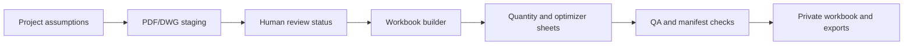

# Architecture

This document describes the public architecture of the cut-on-site wall and conventional pitched roof framing material and build-list workflow. It intentionally omits production code, site data, source plans, generated workbooks, supplier exports, and internal paths.

## System Boundary

The private workflow treats measurement imports as staged evidence:

- PDF and DWG takeoff data can be normalized into import records;
- import records are not trusted until reviewed;
- conventional pitched roof details can be staged for review before order quantities are treated as ready;
- source manifests record file hashes, tools, and run metadata;
- workbook sheets calculate quantities and expose blockers;
- supplier exports separate ready lines from TBA lines;
- verification checks formulas, review status, manifests, and output readiness.

## Workflow Diagram

## Main Components

| Component | Role | Public Repo Status |
| --- | --- | --- |
| Project assumptions | Captures stock length, bearing allowance, spacing, waste, and drawing revision fields | Described only |
| PDF/DWG imports | Stage measured wall, bracing, and floor-area rows with source references | Described only |
| Opening schedule | Links openings to wall IDs and lintel calculations | Described only |
| Conventional pitched roof schedule | Stages rafters, ridge, hips, valleys, ceiling joists, battens, bracing, tie-downs, and engineer-review items | Described only |
| Workbook builder | Generates Excel sheets and formulas | Excluded |
| Source manifests | Track hashes and source freshness for imports | Described only |
| Verification checks | Confirm formulas, review status, manifests, exports, and TBA blockers | Described only |
| Supplier exports | Split ready lines and unresolved TBA items | Excluded |

## Output Model

The private workbook can include:

- Inputs and assumptions;
- PDF/DWG takeoff staging;
- wall measurements;
- opening schedule and opening schedule check;
- conventional pitched roof framing schedule;
- LVL cutting optimizer;
- bulk framing takeoff;
- roof framing material takeoff;
- floor framing;
- engineering details check;
- AS 1684 check register;
- source manifest;
- order summary;
- engineer RFI;
- supplier export tabs;
- QA checks.

## Design Principles

- Reviewed import rows can affect quantities; unreviewed rows remain blockers.
- Lintel cuts include clear span plus total bearing allowance.
- Conventional pitched roof quantities stay review-gated where pitch, bearing, birdsmouth/notching, overhangs, tie-downs, bracing, or engineering details are unresolved.
- Over-stock and missing-span items remain visible as TBA or special order.
- AS 1684 checks require audit completion fields, not formula-only pass states.
- Source manifests must stay fresh when imported data is used.
- Real project records never belong in the public showcase.
